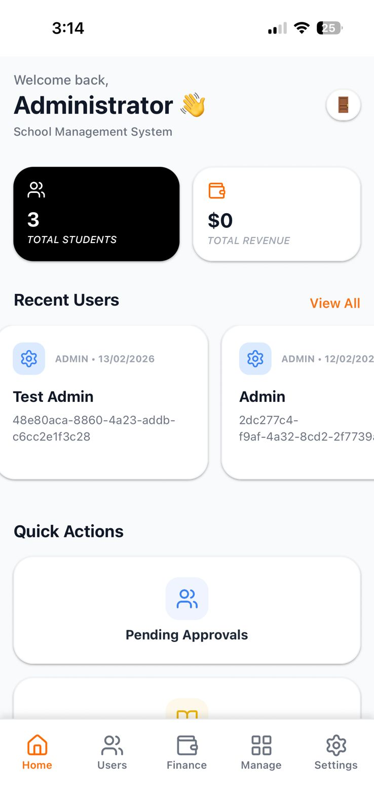
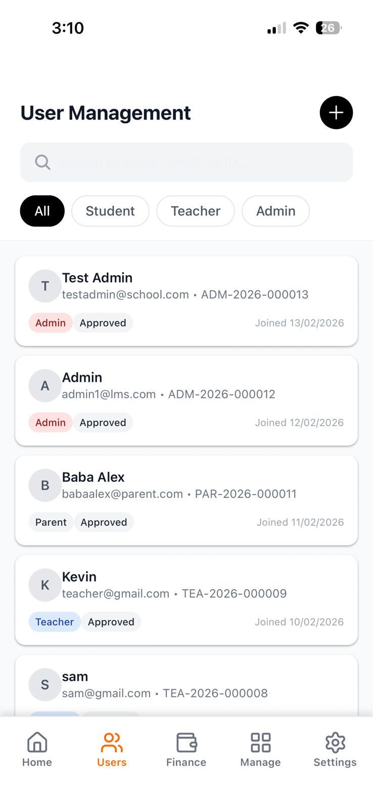
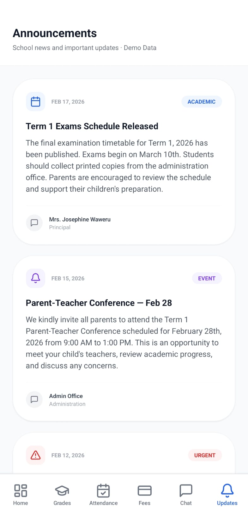
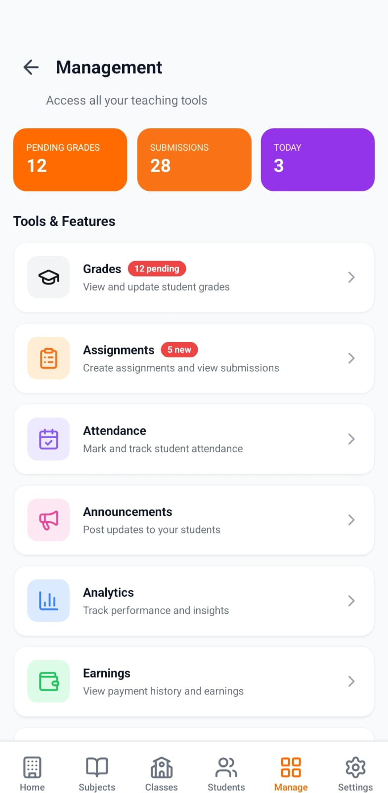

# 📚 LMS Public Documentation

Welcome to the public documentation and demo repository for the Learning Management System (LMS). This project is a comprehensive, role-based mobile application designed for educational institutions.

## 🌟 Overview

The LMS provides tailored experiences for:
- **Students**: Course materials, assignments, and grades.
- **Teachers**: Class management, grading, and attendance.
- **Admins**: Institution-wide analytics and settings.
- **Parents**: Performance tracking and communication.

## 📸 Screenshots

Here are some highlights from the application:

| Feature | Screenshot |
|---------|------------|
| Landing Page |  |
| Dashboard |  |
| Grades |  |
| Library |  |

*(Note: More screenshots are available in the `assets/` directory)*

## 🎥 Demo Video

Watch a walkthrough of the application in action:

[LMS Demo Video](assets/VIDEO-2026-02-19-15-23-27.mp4)

## 🛠 Tech Stack

- **Frontend**: React Native, Expo Router, NativeWind
- **Backend**: Express.js, Supabase (PostgreSQL, Auth, Edge Functions)
- **Tools**: TypeScript, Lucide Icons

---
*For development details, please refer to the private core repository.*
